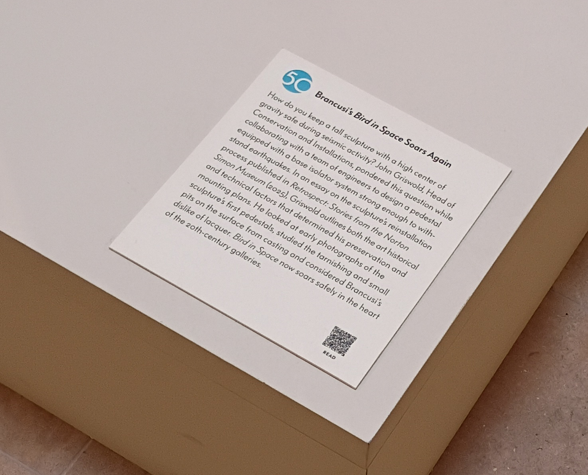

# QR Code Module

A standalone module that generates QR codes linking any physical object to an online record — used here to connect museum artifacts to their digital records, but applicable to any setting where a scannable code should point people to more information.

---

## Overview

In a museum context, QR codes act as a bridge between a physical artifact on display and a richer digital record online. A small printed code is placed beside an object, and a visitor scans it with their phone camera — no app required — to be taken instantly to images, descriptions, historical background, and related materials that wouldn't fit on a physical label. This lets the museum offer deeper, self-guided interpretation without cluttering the exhibit space, update or expand an artifact's information at any time without reprinting signage, and make its collection accessible to visitors in a familiar, low-friction way.

---

## Example in the Wild

The Norton Simon Museum uses this same approach on its exhibit labels. Here a small QR code (marked "READ") sits at the bottom of the label beside Brancusi's *Bird in Space*, letting visitors scan to read the full story behind the sculpture's reinstallation.



---

## Prototype

Two test QR codes were generated and linked to placeholder records uploaded to the Internet Archive:

- **Steamboat bell** — `QR_steamboat-bell.png`
- **Steamboat clock** — `QR_steamboat-clock.png`

| Steamboat Bell | Steamboat Clock |
| :---: | :---: |
|  |  |

**Initial reaction:** The technology has matured to the point where implementation at virtually any size institution is straightforward and easy to implement.

---

## Testing Findings

When the test QR codes were printed, they scanned noticeably faster than codes displayed on a computer screen. They were successfully scanned at under 2 cm (~0.75 inches), though more thorough testing in the Museum environment is needed to determine the ideal size and display options.

Key trade-offs identified so far:

| Variable | Notes |
| :--- | :--- |
| QR code size | Smaller is less intrusive but harder to scan at a distance |
| Lighting conditions | Museum lighting varies and affects scan reliability |
| Phone age | Older devices may be slower to recognize codes |
| OS version | Scanner behaviour differs across iOS and Android versions |
| Camera resolution | Lower resolution reduces reliability at small sizes |

---

## Creating and Implementing QR Codes for Your Museum

1. **Publish an item to the Internet Archive.**

2. **Generate a QR Code** for the item published in the Internet Archive.

3. **Display the printed QR code** next to the artifact.

---

## Open Questions

### Backend

- Is the Internet Archive the right data store to serve your museum artifact data to the public?
- How should backend artifact data be structured?

### Artifact Numbering

- What artifact numbering system can be used?

### Physical Display

- How can QR codes be unobtrusively displayed in a museum?
- What is the best display method?
- What is the ideal size for visibility and scannability?

---

## Usage

The command-line generator lives at `code/generate_qr.py`. It prompts for a URL and an output filename, then writes a PNG with the URL and filename captioned below the QR code.

**Requirements:** Python 3 with the `qrcode` and `Pillow` libraries:

```bash
pip install qrcode Pillow
```

**Run it:**

```bash
cd code
./generate_qr.py
```

You'll be prompted for the two values:

```
Enter the URL to encode: https://example.com
Enter the output filename [qrcode_example.png]: demo.png
Saved QR code to demo.png
```

If you omit the filename, it defaults to `qrcode_example.png`; a `.png` extension is appended automatically when missing.

---

## Status

Prototype complete. A command-line QR code generator, `code/generate_qr.py`, is now available — it prompts for a URL and output filename and writes a PNG with the URL and filename captioned below the code. Lots to talk about and plan before full implementation — it is very doable.

---

*Last updated: 2026-06-19-0358*
